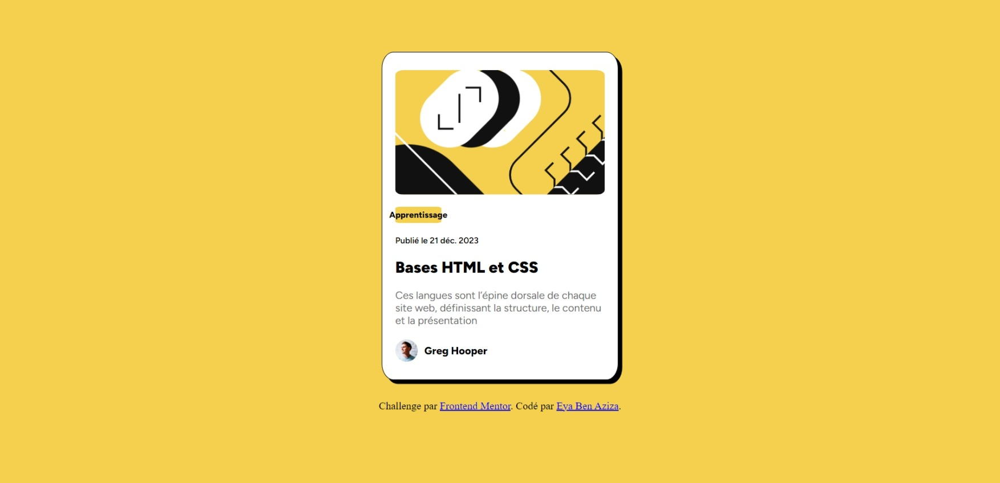

# Frontend Mentor - Blog preview card solution

This is a solution to the [Blog preview card challenge on Frontend Mentor](https://www.frontendmentor.io/challenges/blog-preview-card-ckPaj01IcS). Frontend Mentor challenges help you improve your coding skills by building realistic projects. 

## Table of contents

- [Overview](#overview)
  - [The challenge](#the-challenge)
  - [Screenshot](#screenshot)
  - [Links](#links)
- [My process](#my-process)
  - [Built with](#built-with)
  - [What I learned](#what-i-learned)
  - [Continued development](#continued-development)
- [Author](#author)


**Note: Delete this note and update the table of contents based on what sections you keep.**

## Overview

### The challenge

Users should be able to:

- See hover and focus states for all interactive elements on the page

### Screenshot




### Links

- Solution URL: [Add solution URL here](https://github.com/Eya-ben-aziza/Blog_preview_card_Front_Mentor.git)
- Live Site URL: [Add live site URL here](https://eya-ben-aziza.github.io/Blog_preview_card_Front_Mentor/)

## My process

### Built with

- Semantic HTML5 markup
- CSS custom properties
- Flexbox
- CSS Grid
- [Styled Components](https://fonts.googleapis.com) - For styles


### What I learned
I learned using grid 


To see how you can add code snippets, see below:
```css
.block {
  
    display: grid;
    grid-template-rows: auto;
    align-items: center;
    gap: 5px;
    padding: 20px;
}
```


### Continued development

responsiveness


## Author

- Frontend Mentor - [@yourusername](https://www.frontendmentor.io/profile/Eya-ben-aziza)
